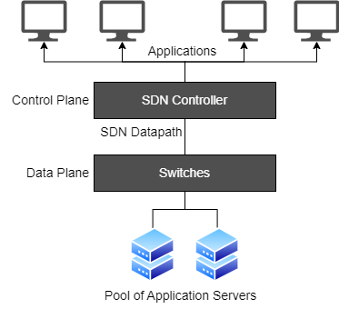

# Software Defined Networking (SDN)

**Autor:** Erik Hammermüller  
 
---

## 1. Was ist SDN?

Software Defined Networking (SDN) ist ein moderner Ansatz zur Netzwerkarchitektur, bei dem die Steuerung eines Netzwerks von der eigentlichen Datenweiterleitung getrennt wird. Konkret bedeutet das, dass die sogenannte **Control Plane (Steuerungsebene)** von der **Data Plane (Datenebene)** entkoppelt wird.

In traditionellen Netzwerken befinden sich beide Funktionen direkt in den Netzwerkgeräten (z. B. Switches oder Router). SDN hingegen verlagert die Steuerungslogik in eine zentrale Software – den sogenannten **SDN-Controller**. Dadurch entsteht ein zentral verwaltbares und programmierbares Netzwerk.

Das Ziel von SDN ist es, Netzwerke flexibler, einfacher zu verwalten und besser automatisierbar zu machen.

---

## 2. Kontext und Einsatzgebiete

SDN wird vor allem in modernen IT-Infrastrukturen eingesetzt, insbesondere in:

- Rechenzentren (Data Center)
- Cloud-Umgebungen
- Unternehmensnetzwerken
- Wide Area Networks (WAN)

Der Grund für den Einsatz liegt darin, dass klassische Netzwerke oft schwer zu verwalten und zu konfigurieren sind. SDN ermöglicht stattdessen eine zentrale Steuerung und Automatisierung des gesamten Netzwerks.

Unternehmen nutzen SDN, um schneller auf neue Anforderungen reagieren zu können und Netzwerke dynamisch anzupassen. Besonders in Cloud- und Virtualisierungsumgebungen ist SDN heute ein zentraler Bestandteil moderner Infrastruktur.

---

## 3. Technische Funktionsweise

### 3.1 Grundprinzip

Das wichtigste Prinzip von SDN ist die Trennung von:

- **Control Plane** → trifft Entscheidungen über den Datenverkehr  
- **Data Plane** → leitet Datenpakete weiter  

In SDN wird die Control Plane zentralisiert und in Software implementiert. Die Netzwerkgeräte führen nur noch die Weiterleitung der Daten aus.

---

### 3.2 Architektur

Die Architektur von SDN besteht typischerweise aus drei Schichten:

#### 1. Application Layer
- Enthält Anwendungen und Netzwerkdienste  
- z. B. Firewall, Load Balancing, Monitoring  

#### 2. Control Layer
- Besteht aus dem SDN-Controller  
- zentrale Instanz zur Steuerung des Netzwerks  
- hat einen globalen Überblick über das gesamte Netzwerk  

#### 3. Infrastructure Layer
- Physische oder virtuelle Geräte (Switches, Router)  
- führen die Anweisungen des Controllers aus  

---

### 3.3 Kommunikation im SDN

Die Kommunikation innerhalb der SDN-Architektur erfolgt über sogenannte APIs:

- **Southbound APIs** → Verbindung zwischen Controller und Netzwerkgeräten  
- **Northbound APIs** → Verbindung zwischen Controller und Anwendungen  

Diese Schnittstellen ermöglichen die Programmierbarkeit und Automatisierung des Netzwerks.

Typische Protokolle sind:

- OpenFlow  
- NETCONF  
- gRPC  

Diese Protokolle dienen der Kommunikation innerhalb einer SDN-Architektur:

- **OpenFlow** wird verwendet, um die Weiterleitung von Datenpaketen in Netzwerkgeräten zu steuern.  
- **NETCONF** dient der Konfiguration und Verwaltung von Netzwerkgeräten.  
- **gRPC** ist ein modernes Kommunikationsframework für schnelle und effiziente API-Kommunikation zwischen Anwendungen und Controllern.  

---

## 4. Tools, Produkte und Hersteller

### Tools & Plattformen

- SDN-Controller (zentrale Steuerung)  
- Netzwerkmanagement-Software  
- Automatisierungstools  

### Hersteller

- Cisco (z. B. ACI – Application Centric Infrastructure)  
- Red Hat (Open-Source-basierte Lösungen)  
- Microsoft (SDN in Windows Server)  

Diese Anbieter entwickeln Lösungen, die SDN in verschiedenen Bereichen wie Rechenzentren oder Cloud-Umgebungen einsetzen.

---

## 5. Vorteile von SDN

SDN bietet zahlreiche Vorteile gegenüber klassischen Netzwerken:

- **Zentrale Verwaltung**  
  Das gesamte Netzwerk kann von einer zentralen Stelle gesteuert werden.  

- **Automatisierung**  
  Netzwerke können automatisch konfiguriert und verwaltet werden.  

- **Flexibilität**  
  Netzwerke lassen sich schnell an neue Anforderungen anpassen.  

- **Skalierbarkeit**  
  SDN eignet sich besonders gut für große und wachsende Infrastrukturen.  

- **Effizienz**  
  Reduziert manuellen Aufwand und minimiert Fehlerquellen.  

---

## 6. Herausforderungen und Nachteile

Trotz vieler Vorteile gibt es auch Herausforderungen:

- **Single Point of Failure**  
  Der zentrale Controller kann kritisch sein. Ein Ausfall würde das gesamte System beeinträchtigen.  

- **Komplexität**  
  Neue Architektur erfordert Umdenken.  

- **Sicherheitsrisiken**  
  Zentralisierung kann ein Angriffspunkt sein.  

- **Migration**  
  Der Umstieg von klassischen Netzwerken ist aufwendig.  

---

## 7. Beispiel aus der Praxis

Ein typisches Beispiel ist ein Rechenzentrum:

Ein Administrator möchte ein neues Netzwerk für eine Anwendung bereitstellen.

Mit SDN kann dies zentral über den Controller erfolgen:

- Netzwerk wird softwarebasiert definiert  
- Regeln werden automatisch angewendet  
- Geräte werden zentral konfiguriert  

Ohne SDN müsste jedes Gerät einzeln manuell konfiguriert werden.

---

## 8. Fazit

Software Defined Networking ist eine Schlüsseltechnologie moderner IT-Infrastrukturen. Durch die Trennung von Steuerung und Datenweiterleitung wird das Netzwerk flexibler, programmierbar und leichter zu verwalten.

Vor allem in Cloud-Umgebungen und großen Netzwerken ist SDN heute unverzichtbar. Trotz einiger Herausforderungen überwiegen die Vorteile deutlich, weshalb SDN als wichtiger Bestandteil zukünftiger Netzwerke gilt.

---

## 9. Quellen

- Cisco – Software Defined Networking  
  https://www.cisco.com/c/de_de/solutions/software-defined-networking/overview.html  

- Red Hat – What is Software Defined Networking  
  https://www.redhat.com/de/topics/hyperconverged-infrastructure/what-is-software-defined-networking  

- Microsoft – SDN Overview  
  https://learn.microsoft.com/de-de/windows-server/networking/sdn/  

- Tutorialspoint – SDN Architecture  
  https://www.tutorialspoint.com/software-defined-networking/software-defined-networking-architecture.htm  
